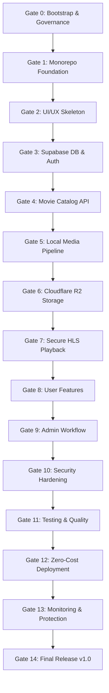

# Zero-Cost Movie Streaming Platform - Gate Implementation Plan

## Overview
15 sequential milestones designed for safe, verifiable, zero-cost development under free-tier limits.

---

## Gate Checklist & Summary

| Gate | Title | Primary Focus | Key Deliverables | User Action Needed? |
|:---:|:---|:---|:---|:---:|
| **0** | **Bootstrap & Governance** | Safe environment setup | Tooling audit, `AGENTS.md`, docs hierarchy, `.env.example`, `.gitignore` | Yes (Git review) |
| **1** | **Monorepo Foundation** | Clean architecture skeleton | `apps/web` (Vite+React), `apps/api` (Hono Workers), `packages/shared` | No |
| **2** | **UI/UX Skeleton** | Mock-driven complete UI | 10 pages, responsive layouts, player shell, mock data | Yes (Click-through) |
| **3** | **Supabase DB & Auth** | Real auth & relational schema | Profiles, Movies, Genres, Favorites, WatchHistory, RLS policies | Yes (Supabase project) |
| **4** | **Movie Catalog API** | Real REST & Admin endpoints | Public & Admin routes with Zod validation | No |
| **5** | **Local Media Pipeline** | Local FFmpeg transcoding | `tools/media/`, 720p/480p HLS generation, master playlist validation | Yes (FFmpeg + test video) |
| **6** | **Cloudflare R2 Storage** | Object storage integration | Pre-upload size estimation, zero-cost budget guards (< 8GB) | Yes (R2 credentials) |
| **7** | **Secure HLS Playback** | Authorized streaming | Playback token authorization, HLS.js player, quality switcher | No |
| **8** | **User Features** | Polish viewer experience | Favorites, Watch History, Continue Watching, Throttled progress | No |
| **9** | **Admin Movie Workflow** | Content management lifecycle | Draft -> Ready -> Publish flow, metadata assignment | Yes (Movie source) |
| **10** | **Security Hardening** | Penetration review | IDOR prevention, CORS, token safety, least privilege check | No |
| **11** | **Testing & Quality** | Comprehensive verification | E2E critical flows, integration tests, typecheck, production build | No |
| **12** | **Zero-Cost Deployment** | Public release on free tier | Cloudflare Pages + Workers deployment, Supabase linkage | Yes (Deployment auth) |
| **13** | **Monitoring & Protection**| Cost runaway prevention | Storage telemetry, quota alerts, upload blocker (> 8GB) | No |
| **14** | **Final Release** | v1.0.0 freeze | Full audits, documentation review, Git tag `v1.0.0` | Yes (Final sign-off) |
